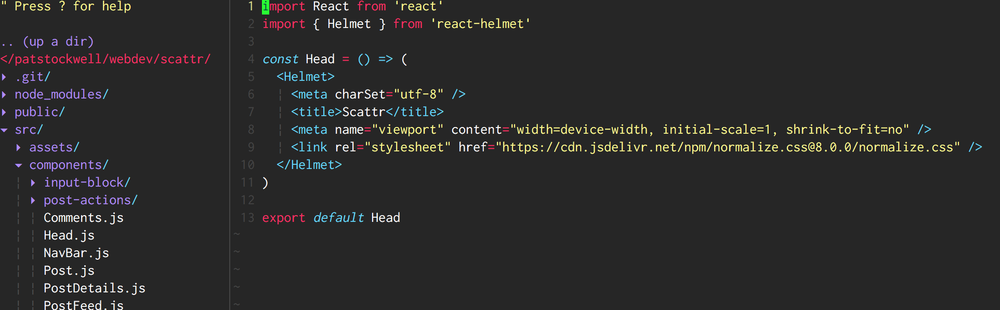

# vim-monokai-tasty

Monokai forever! :tada: Inspired by Sublime Text's interpretation of monokai, this colour scheme makes use of cterm color numbers to support VIM running on a wide range of systems.
It has been customised for Javascript highlighting, but works for all languages :heart:

## :electric_plug: Installation

I recommend using [Plug](https://github.com/junegunn/vim-plug).

Add the following to your `.vimrc` and run `PlugInstall`

```javascript
Plug 'patstockwell/vim-monokai-tasty'
```

Works best with these if you write javascript or React
```javascript
Plug 'pangloss/vim-javascript'
Plug 'mxw/vim-jsx'
Plug 'styled-components/vim-styled-components'
Plug 'elzr/vim-json'
```

## :wolf: Use

Add to your `.vimrc`:

```
colorscheme vim-monokai-tasty
```

If you use a terminal that supports italic text, add
```
let g:vim_monokai_tasty_italic = 1
```

## :tv: Screen shots





